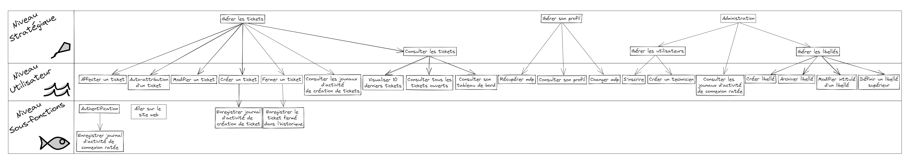

# SAE 3.01 - Recueil de besoins

## Sommaire

* [**Chapitre 1**](#part1) **:** _Objectif et portée_
* [**Chapitre 2**](#part2) **:** _Terminologie employée / Glossaire_
* [**Chapitre 3**](#part3) **:** _Cas d’utilisation_
* [**Chapitre 4**](#part4) **:** _Technologies employées_
* [**Chapitre 5**](#part5) **:** _Autres exigences_
* [**Chapitre 6**](#part6) **:** _Informations complémentaires_

---

## Objectif et portée

Ce projet vise à mettre en place une plateforme web de ticketing interne au département BUT Informatique de l'IUT de Vélizy.
Il aura pour but de proposer un moyen de signaler les problèmes informatiques dans les salles de TP plus facilement, afin
de pouvoir les régler plus efficacement, en offrant de nombreuses manières de gérer les demandes de dépannage formulées.

Le tableau des éléments définit les différents objets qui rentreront en compte dans le projet, et les limites du système à implémenter.
Il détaille également les différents acteurs de la plateforme que l'on distingue, ainsi que les actions que ces derniers devront
pouvoir effectuer. Tout ceci a été déterminé à partir du **Cahier des Charges** fourni par le client et formulé en _Annexe 1_.

### Tableau des élements du projet

<table border="1">
    <tr>
        <th>Objets</th>
        <th>Acteurs</th>
        <th>Actions</th>
    </tr>
    <tr>
        <td>
            <ul>
                <li>Ticket (Demande de dépannage)</li>
                <li>Tableau de bord</li>
                <li>Journal d’activité
                    <ul>
                        <li>Connexions ratées</li>
                        <li>Tickets validés</li>
                    </ul>
                </li>
                <li>Page d'accueil
                    <ul>
                        <li>Texte explicatif</li>
                        <li>Vidéo démonstrative</li>
                        <li>10 derniers tickets</li>
                        <li>Formulaire d’inscription</li>
                    </ul>
                </li>
                <li>Historique de tickets fermés</li>
                <li>Page de récupération de mot de passe en construction</li>
                <li>Libellé</li>
            </ul>
        </td>
        <td>
            <ul>
                <li>Visiteur</li>
                <li>Utilisateur inscrit</li>
                <li>Technicien</li>
                <li>Administrateur web</li>
                <li>Administrateur système</li>
            </ul>
        </td>
        <td>
            <ul>
                <li>Aller sur le site web</li>
                <li>Se connecter</li>
                <li>Enregistrer un journal de connexion infructueuse</li>
                <li>Consulter les journaux d'activité de connexion infructueuse</li>
                <li>Se déconnecter</li>
                <li>Gérer les tickets
                    <ul>
                        <li>Affecter un ticket</li>
                        <li>Auto-attribution d'un ticket</li>
                        <li>Modifier un ticket</li>
                        <li>Créer/Ouvrir un ticket
                            <ul>
                                <li>Enregistrer un journal de création de ticket</li>
                            </ul>
                        </li>
                        <li>Consulter les journaux d'activité de création de ticket</li>
                        <li>Fermer un ticket
                            <ul>
                                <li>Enregistrer le ticket fermé dans l'historique</li>
                            </ul>
                        </li>
                        <li>Consulter les tickets
                            <ul>
                                <li>Visualiser les 10 derniers tickets</li>
                                <li>Consulter tous les tickets ouverts</li>
                                <li>Consulter son tableau de bord</li>
                            </ul>
                        </li>
                    </ul>
                </li>
                <li>Gérer son profil
                    <ul>
                        <li>Consulter son profil</li>
                        <li>Changer son mot de passe</li>
                        <li>Récupérer son mot de passe (page en construction)</li>
                    </ul>
                </li>
                <li>Gérer les utilisateurs
                    <ul>
                        <li>S'incrire</li>
                        <li>Créer un compte technicien</li>
                    </ul>
                </li>
                <li>Gérer les libellés
                    <ul>
                        <li>Créer un libellé</li>
                        <li>Supprimer/Archiver un libellé</li>
                        <li>Modifier l'intitulé d'un libellé</li>
                        <li>Définir un libellé supérieur</li>
                    </ul>
                </li>
            </ul>
        </td>
    </tr>
</table>

Chaque action pouvant être effectuée sur la plateforme est considérée comme un objectif à portée plus ou moins éloignée du Système.
Il est donc nécessaire de distinguer les différents niveaux d'objectifs :
- **Objectifs Stratégiques** : Objectif et raison d'être du système. Identifie les fonctions principales du système pour l'entreprise.
- **Objectifs Utilisateurs** : Objectif poursuivi par un utilisateur lorsqu'il utilise le système. Il correspond à une tâche élémentaire de l'utilisateur.
- **Objectifs Sous-fonction** : Participe à la réalisation d'un objectif utilisateur, duquel il fait partie intégrante.

## Tableau des niveaux d'objectifs

Pour une explication de chaque objectif, dit Cas d'Utilisation, merci de se référer au [**Chapitre 3**](#part3) de ce document.

---

## **Terminologie employée / Glossaire**

**Ticket :** _Demande de dépannage à traiter_

**Statut :** _Etat d'avancement de la résolution du ticket_

**Libellé :** _Titre du ticket, précisant la nature de la demande_

**Tableau de bord :** _Interface de contrôle et de consultation utilisateur_

**Journal :** _Fichier d'enregistrement d'activité_

---

## Cas d’utilisation

Pour une explication détaillée de chaque objectif, dit Cas d'utilisation, merci de se référer au **Chapitre 3** du dossier de
spécifications _(Annexe 3)_.

- **Cas d'utilisation 1 : Aller sur le site web**

---

## Technologies employées

### Présentation des technologies

Dans le cadre de ce projet, nous avons décidé d'utiliser les technologies suivantes :
- [**PHP**](https://www.php.net/) : Langage de programmation côté serveur
- [**MySQL**](https://www.mysql.com/fr/) : Système de gestion de base de données relationnelles
- [**HTML**](https://www.w3.org/html/) : Langage de description de pages web
- [**CSS**](https://www.w3.org/Style/CSS/Overview.fr.html) : Langage de style
- [**git**](https://git-scm.com/) : Logiciel de gestion de versions décentralisé
- [**Rasperri PI**](https://www.raspberrypi.org/) : À décrire plus tard

L'interface graphique sera réalisée en HTML et CSS, et le code PHP sera utilisé pour la gestion des données et des requêtes. Le système de gestion de base de données MySQL sera utilisé pour stocker les données. Le logiciel de gestion de versions git sera utilisé pour le travail collaboratif.

### Justification des choix

L'intérêt de ces technologies est qu'elles sont toutes open-source, et donc gratuites. De plus, elles sont toutes très répandues et bien documentées, ce qui facilite leur utilisation.

Le PHP est un langage de programmation côté serveur, c'est-à-dire qu'il est exécuté sur le serveur, et non sur le navigateur de l'utilisateur. Il permet de générer du code HTML, qui sera ensuite interprété par le navigateur. Il permet également de communiquer avec la base de données. Il est donc très utile pour la réalisation de ce projet.
Concernant la sécurité du site, le PHP permet de protéger les données sensibles, comme les mots de passe, en les cryptant. Il permet également de protéger le site contre les attaques XSS (Cross-Site Scripting) et CSRF (Cross-Site Request Forgery) mais pas par défaut, il nous faut donc faire preuve de vigilance.

Le MySQL est un système de gestion de base de données relationnelles. Il nous fallait un moyen de stocker les données du site, et de les manipuler ; le MySQL est particulièrement adapté à nos besoins puisque contrairement à d'autres systèmes de gestion de base de données, il est gratuit et open-source. Il est également très répandu, et donc bien documenté.

Le HTML est un langage de structure de pages web. Il est simplement indispensable pour la réalisation de ce projet, puisqu'il permet de créer l'interface graphique du site. Il est souvent inséparable du CSS qui le stylise et du JavaScript, qui permettent de styliser et d'animer les pages web. Ce dernier en revanche est souvent utilisé pour des sites plus complexes et son utilisation est parfois critiquée car il peut gravement ralentir le chargement des pages web.

Git est un logiciel de gestion de versions décentralisé. Il permet de travailler à plusieurs sur un même projet, en gérant les conflits de versions. Il permet également de revenir à une version antérieure du projet, en cas de problème. Il est donc très utile pour le travail collaboratif. De plus, il peut être couplé à divers services en ligne, comme GitHub, qui permettent de stocker le code en ligne, et de le partager avec d'autres personnes.

##### *Section Rasperri Pi à ajouter*

---

## Autres exigences

### Processus de développement

On compte comme intervenants dans ce projet une équipe de 5 élèves du BUT Info, à savoir Loan Quillet, Lucas Da Silva Ferreira,
Breval Ferrari, Baptiste Fournier et William Herubel. Le client est un professeur à l'IUT de Vélizy nommé Fabrice Hoguin, mais de nombreux autres
professeurs sont et seront amenés à intervenir lors de ce projet pour rediriger son cours, définir de nouvelles exigeances
et demander des travaux et des rendus supplémentaires dans le cadre de la formation.

Le projet doit privilégier l'accessibilité et la simplicité avant tout. N'importe quel utilisateur doit pouvoir utiliser la plateforme web pour
signaler des problèmes, et ce, de manière simple et évidente, intuitive. La plateforme web doit également être robuste, afin d'éviter
toute fuite de données ou crash de la plateforme.

Le client souhaite une communication par mail fréquente afin de tenir au courant des avancées et des choix effectués par l'équipe
de développement. Ainsi, il pourra facilement rectifier les erreurs commises ou modifier ce qui n'est pas à l'image de ce qu'il
a en tête. 

Le développement en PHP & MYSQL a été imposé par le cahier des charges, et il sera nécessaire d'héberger le site web sur un Raspberry
Pi, établir une connection ssh avec n'importe quel ordinateur de l'IUT, et configurer une Carte SD pour le serveur.

### Sécurité

Les données devront être protégées, et le site ne doit afficher que ce que chaque utilisateur a le droit de voir. Pour cela, il
sera impératif de sécuriser les requêtes SQL formulées par les fichiers PHP, pour restreindre le plus possible les accès et limiter
les failles de sécurité. De plus, tout mot de passe devra être crypté avant d'être enregistré dans la base de données, là encore
afin de limiter les conséquences d'une fuite.

### Portabilité

La plateforme web devra être hébergée sur un Raspberry PI, et posséder une Carte SD configurée par l'équipe de développement.
De plus, il faudra pouvoir accéder en ssh à la plateforme depuis n'importe quel moniteur de l'IUT.

---

## Informations complémentaires

Ce livrable a été réalisé en Cycle de vie Cascade, car il y a eu des défauts organisationnels lors de ce premier livrable.
Nous avons commencé par lire le Cahier des Charges, puis nous avons fait une analyse des besoins détaillée sur tout le projet,
en même temps que de faire la charte graphique et les logos, par la suite, nous avons réalisé un diagramme en vue composant-connecteur
pour concevoir la structure du projet, suite à quoi nous avons réalisé les maquettes web, puis les sites statiques. 

Nous avons ensuite réalisé le test du site statique en regardant s'il correspond à la maquette, avant de tout finaliser pour
un rapport final. La documentation a été rédigée en parallèle à ces dernières étapes. À l'avenir, nous essaierons de nous orienter
sur des cycles de vie permettant d'implémenter des méthodes agiles, comme nous avons essayé de le faire en fin de ce livrable.

---
