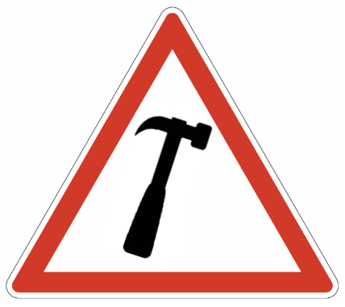
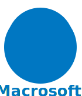
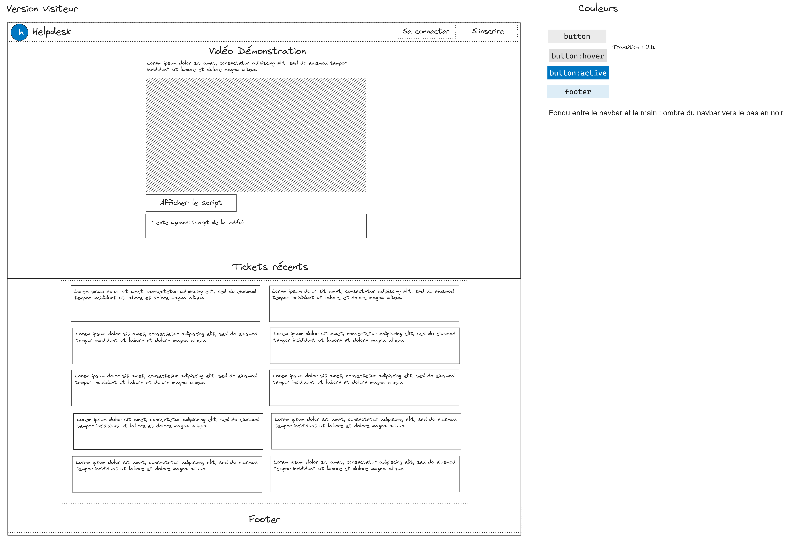
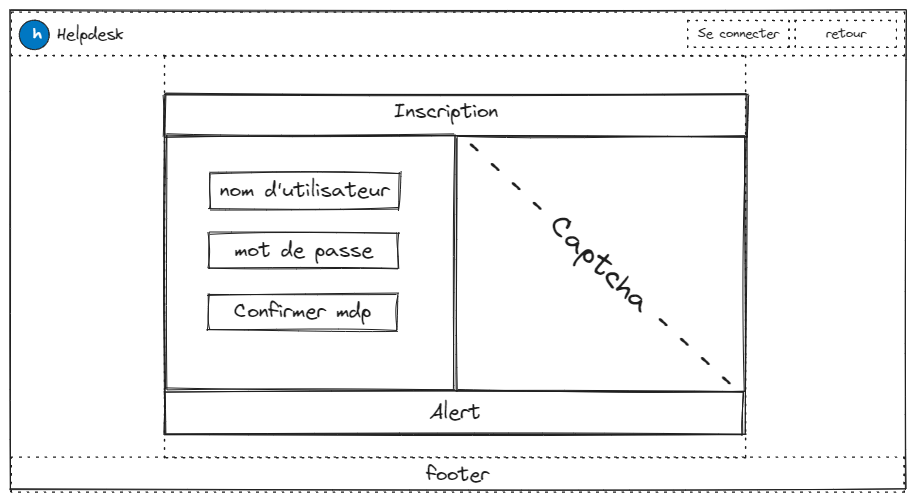

# SAE 3.01 - Spécifications

## Sommaire

* [**Chapitre 1**](#part1) **:** _Introduction_
* [**Chapitre 2**](#part2) **:** _Charte graphique_
* [**Chapitre 3**](#part3) **:** _Maquettes Web_
* [**Chapitre 4**](#part4) **:** _Cas d'utilisations_
* [**Chapitre 5**](#part5) **:** _Intégration_

---

## Introduction
Ce dossier de spécifications est un document détaillant le comportement que devra avoir le système. Cela comporte l'affichage
que doivent avoir les pages web du projet, ainsi que les différents cas d'utilisations du système. Il ne détaillera pas l'implémentation
réelle des contraintes listées ici, pour cela, référez-vous au **Dossier de Conception** _(Annexe 4)_.

---

## Charte graphique

Notre projet est une plateforme de ticketing destiné à aider des techniciens à résoudre des problèmes techniques rencontrés
par des utilisateurs via une interface unique, mais polymorphe. Cette charte tente donc de proposer une solution pour relier
à la fois les valeurs et intentions en lien avec les utilisateurs et les techniciens, les deux principaux types d’usagers.
Vous verrez que pour la première version du logo, une charte plus ancienne a été utilisée (qui sera résumée dans la section
correspondante) ; elle est maintenant obsolète.

Plusieurs hypothèses peuvent être posées sur les caractéristiques de l’utilisateur. Comme il utilise notre produit comme une
solution d’aide technique, ses connaissances dans le domaine de son problème peuvent être peu ou pas développées. Le but du code
graphique est donc de le rassurer par le choix des couleurs, des formes et de la typographie.

Les couleurs sont toutes froides en rapport avec la couleur du logo (#0077c2) sauf quand : il s’agit de faire contraste sur une
couleur froide sans autre solution ; une urgence ou un élément important nécessite l’attention immédiate de l’utilisateur
(destruction de données, erreurs…). Dans ce dernier cas, la couleur utilisée doit être de préférence un rouge intense (plus ou
moins clair pour faciliter la lecture).

Ensuite, les bords arrondis sont moins hostiles et ainsi le site comme le logo doit éviter les bords raides. Tous les angles
extérieurs indépendants (sans angles adjacents) du site doivent être arrondis à part si cette transformation nuit à l’accessibilité
ou l’ergonomie. Pour ces deux derniers principes, la couleur des éléments sera appliquée de préférence sur l’arrière-plan que
sur le texte ou l’avant-plan, et les éléments interactifs seront toujours suffisamment gros.

La police de caractère utilisée est Calibri. Cette police de Microsoft a été une de leurs préférées dans l’histoire de leurs
produits, souvent police par défaut dans leurs outils de traitement de texte puisqu’elle est très neutre, proche d’Arial. Elle
est aussi très homogène et facile à lire et a été décrite comme ayant un caractère doux et chaleureux par son créateur Lucas
de Groot (https://en.wikipedia.org/wiki/Calibri#cite_note-Lucasfonts-4). Elle est donc parfaite pour une utilisation en logo
et sur toute la page.

Mettons-nous maintenant à la place du second principal utilisateur de notre projet : le technicien. Nous avons été tenté de
privilégier une interface plus simple voir technique puisqu’il s’agit d’un public plus expérimenté, or il y a de bonnes raisons
de rejeter cette proposition.

Le technicien est amené à utiliser cette interface quotidiennement. Il faut donc prendre soin de l’ergonomie du site pour
éviter toute frustration et fatigue au long terme. Ainsi, les animations seront uniquement fonctionnelles (pour souligner une
latence contrôlée par exemple). Cela permettra également de limiter le temps de chargement du site. Ensuite, un site agréable
à utiliser est un site élégant, mais aussi neutre, avec peu de couleurs, beaucoup d’espace et une police neutre (Calibri est
encore parfaite pour cet effet).

Enfin, entre techniciens et utilisateurs la différence de compétences peut conduire à des conflits : les techniciens régulièrement
exposés aux mêmes problèmes parfois très simples peuvent être amenés à résumer l’intelligence et l’expérience d’un utilisateur
à ses compétences informatiques et ainsi stéréotyper les utilisateurs. C’est un problème régulier des domaines informatiques
auquel nous sommes nous-même constamment confrontés (quand des élèves se moquent de professeurs ayant du mal à utiliser leur matériel
informatique par exemple). 

Pour palier à ce problème, il est nécessaire de rétablir une égalité entre technicien et utilisateur
en proposant aux deux profils le même style graphique, même si l’interface diffère fonctionnellement. Ce n’est dans notre cas
même pas un problème puisque les deux styles sont compatibles.

### Version 1
Voici la première version du logo de Macrosoft™ Helpdesk :

Il s’agit d’un panneau de danger rectangulaire blanc encadré de rouge contenant un marteau noir à 110° vers la droite. Il a
été réalisé sur l’outil de diagramme collaboratif Excalidraw. Pour ce logo, une ancienne version de la charte graphique a été
utilisée. Comme vous le voyez, la couleur dominante de ce logo est le rouge ; l’idée était d’utiliser des couleurs chaudes
pour à la fois rassurer les utilisateurs et mettre en avant la compétence des techniciens. Le panneau triangulaire faisait
allusion à la complexité technique et la délégation des incidents des utilisateurs aux techniciens. Le marteau évoquait le
matériel et les moyens solides dont dispose les techniciens pour résoudre ces problèmes. Un logo sobre, mais frappant.

### Version 2
Voici la nouvelle version :

Un cercle bleu englobe un H minuscule blanc dont les deux pieds dépassent du cercle. En dessous est écrit de la même couleur
le nom de notre entreprise et au-dessus se devine un faible halo bleu. Avec la nouvelle charte, tous les aspects du logo ont
changé. 

Les couleurs chaudes ont été remplacées par les couleurs froides qui sont plus relaxantes en pratique. La rondeur de
la charte y passe par la forme extérieure du logo, le texte écrit en Calibri et l’arc du H minuscule. Ce dernier est le H de
Helpdesk, le produit de Macrosoft™ ciblé par ce logo. Le nom de notre entreprise est posé en dessous pour montrer la relation
d’appartenance. Le bleu et la sobriété du logo représente bien les valeurs de la charte en soulignant l’honnêteté et la patience
des techniciens ainsi que l’innocence des clients ayant besoin d’aide.

Ce logo comporte aussi deux autres éléments importants. L’arche du H avec la hauteur de la partie inférieure de la lettre laisse
deviner une porte, l’interface de notre site qui relie les deux profils d’utilisateur sans obstacle, préjugé ou égo. Enfin,
le halo au-dessus du cercle évoque une ampoule ou une chandelle, une lumière : le savoir neutre et efficace proposé par des
techniciens charitables, mais aussi la lueur qui éclaire des problèmes de solutions fiables, mais imparfaites, ce qui souligne
l’humilité des techniciens qui sont tout aussi humains que les utilisateurs qu’il assiste.

### Verdict
Après comparaison des deux logos, le second a été choisi. Le premier logo est rouge et blanc, or le rouge a l’effet inverse
de celui attendu. Ce logo est stressant et non rassurant, et c’est aussi parce qu’il est à l’image d’un panneau de danger du
code de la route. Dû à cette ressemblance, la forme du logo pose d’ailleurs de potentiels problèmes légaux et pourrait être
confondue avec un vrai panneau du code de la route. D’autre part, les formes du logo ont en grande partie des bords raides et peu
confortables pour les yeux, une agressivité qu’on veut absolument éviter dans ce contexte. La couleur n’est pas mise en avant
et ne sert que de bord. Enfin, rien dans le logo ne donne ou ne suggère le nom de l’entreprise ou du produit.

Le second logo est donc largement plus travaillé et conforme aux valeurs du produit et de l’entreprise. Il règle les principaux
problèmes du premier logo et est ainsi parfait pour notre utilisation.

---

## Maquettes web

Les deux pages statiques de ce livrable sont celles de la page d'accueil (vue Visiteur) et celle de l'inscription à la plateforme.

### Maquette de la page d'accueil (vue Visiteur)

La page d'accueil en vue Visiteur doit contenir :
- Le logo du site web et son nom
- Un bouton d'inscription
- Un bouton de connexion
- Un texte explicatif qui décrit le but de la plateforme
- Une vidéo explicative qui montre comment utiliser la plateforme
- Un affichage des 10 derniers tickets formulés (uniquement leurs libellés)

### Maquette de la page d'inscription

La page d'inscription doit contenir :
- Le logo du site web et son nom
- Un bouton de retour à l'accueil
- Un bouton de connexion
- Un formulaire d'inscription avec nom d'utilisateur, mot de passe et confirmation du mot de passe
- Un captcha à valider afin de pouvoir s'inscrire

---

## Cas d'utilisations

### Cas d'utilisation 1 : Aller sur le site web
**Nom :** Aller sur le site web

**Contexte d'utilisation :** On assure la connexion au site web.

**Portée** : Sous-système

**Niveau** : Sous-fonction

**Garantie en cas de succès :** Connexion au site web.

## Intégration

### Introduction

Il nous est demandé dans le cahier des charges d’intégrer notre site sur un Raspberry Pi 4b fourni par le client. Ainsi y doivent être centralisés la base de données, le serveur web et les fichiers source. Naturellement, nous avons pensé à utiliser une solution contenairisée : Docker / Podman, NixOS… Finalement, nous avons opté pour une solution proposée directement par Raspberry sur GitHub, `pi-gen`.

### Pi-Gen

Pi-Gen est un outil de génération d’image Linux et plus précisément RaspOS, la distribution de Raspberry basée sur Debian. L’outil assemble des stages Linux du *bootstrap* à l'environnement graphique complet. Ces stages sont représentés sous forme de dossiers avec des scripts et des listes de paquets à installer exécutables sur l’hôte et l’invité. En effet, après le *bootstrap* initial, l'environnement RaspOS est *chrootable* c’est-à-dire qu’on peut émuler ses composants “à froid”, sans *boot*. La construction est donc entièrement personnalisable et nous permet de produire une image sur-mesure sans intervention manuelle.

Notre image se limite au stage 2 qui équivaut à une installation *lite* ou minimale en ligne de commande. Nous avons ajouté une étape au stage 2 en ajoutant un sous-dossier au dossier du stage avec à l’intérieur de quoi installer entre autres mariadb (mysql), php et apache2 et un script qui ajoute l’utilisateur "p6nj", lui permet un *sudo* sans mot de passe, clone la repo de Macrosoft en exécutant le script d’installation qui y est contenu et configure la connexion automatique en local.
Un snapshot de la repo dans laquelle cette configuration a eu lieu vous sera fournie en zip.

Ce processus pose tout-de-même un problème ; même si la portabilité de l’outil est garanti par un script passant par Docker (install-docker.sh), la génération prend au moins 30 minutes pendants lesquelles on ne peut ni toucher aux scripts ni éteindre la machine sur laquelle le script tourne. Il faut aussi une bonne puissance et une bonne connexion réseau. Nous avons donc pensé à déléguer cette tâche à un serveur en ligne, et nous sommes partis sur une *GitHub Action*.

### Github Actions

Une action GitHub est un fichier en YML décrivant une procédure à effectuer en rapport avec le projet GitHub sur laquelle elle est exécutée. Cela peut servir à compiler du code, effectuer des tests avant un commit ou un merge, etc. Nous avons ainsi détaillé la génération de l’image customisée par une machine virtuelle sous Ubuntu à réaliser à chaque commit. Cette image est ensuite mise en ligne dans une release avec une description informative.
La génération a lieu sur un "runner" public de GitHub (image Docker sur un serveur) ; toute erreur est traçable avec un log et notifiée par mail. Cela rend le tout plus pratique et portable tout en fournissant un accès constant aux différentes images qui sont lourdes à déplacer (>1Go compressées).

### Conclusion

Cette pile permet donc de générer des images prêtes à l’emploi de manière complètement automatique.
Ces images sont ensuite simplement gravées sur une carte SD (via dd) et insérées dans la Raspberry.
