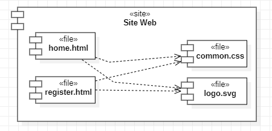

# SAE 3.01 - Conception

## Sommaire

* [**Chapitre 1**](#intro) **:** _Introduction_
* [**Chapitre 2**](#part1) **:** _Approche_
* [**Chapitre 2**](#part2) **:** _Conception architecturale_

## Introduction

Ce document détaille comment le projet a été implémenté et conçu. Il détaillera les différentes vues de la structure du projet,
ainsi que les comportements de ce dernier vis à vis des utilisateurs. Pour voir les spécifications à suivre, consultez le

**Dossier de Spécifications** _(Annexe 3)_.

## Approche

### Introduction

Dans le cadre de notre projet, nous adoptons une approche orientée objet. Nous verrons tout d'abord en quoi elle 
consiste puis pourquoi nous l'avons choisi et enfin comment nous l'avons implementé dans notre projet.

### Définition

L'approche orienté objet se divise en quatre étapes :

- **Abstraction**
- **Encapsulation**
- **Classification**
- **Polymorphisme**

**Abstraction :** L'abstraction est le processus de simplification d'un objet ou d'un concept en identifiant uniquement les 
caractéristiques et les comportements essentiels, tout en ignorant les détails non pertinents. Elle permet de se 
concentrer sur l'essentiel pour mieux comprendre et représenter un objet. Par exemple, lors de la modélisation d'un 
système de ticketing, on pourrait abstraire un "événement" pour inclure uniquement les propriétés essentielles, telles 
que le nom, la date et le lieu, en ignorant les détails complexes.

**Encapsulation :** L'encapsulation consiste à regrouper les données (attributs) et les méthodes (fonctions) qui opèrent sur
ces données en une seule unité, appelée classe. Cette unité limite l'accès direct aux attributs.

**Classification :** La classification, permet de créer de nouvelles classes en se basant sur des classes existantes. 
Par exemple, si l'abstraction le suggère, les classes "Romans" et "BD" peuvent être fusionnées en une classe nommée 
"Ouvrages".

**Polymorphisme :** Le polymorphisme signifie que différentes classes peuvent répondre de manière différente aux mêmes 
messages ou aux mêmes méthodes. Il permet de traiter des objets de classes différentes de manière uniforme. Par exemple,
dans un système de ticketing, vous pourriez avoir une méthode "acheterTicket" qui peut être invoquée sur différentes 
classes de tickets, mais qui se comportera de manière spécifique en fonction du type de ticket.

### Motivation

En utilisant cette méthodologie, nous pouvons représenter les différents composants de notre service de ticketing sous
forme d'objets, ce qui facilite la gestion des données, des interactions et des opérations. 
Cela nous permet de modéliser notre système de manière plus organique et efficace. Cette approche nous offre une plus 
grande modularité, une réutilisation du code plus efficace et une maintenance simplifiée, tout en rendant notre 
architecture plus flexible pour les futures évolutions du projet. En intégrant les principes de l'approche orientée 
objet, nous sommes convaincus que notre système de ticketing sera plus cohérent, plus extensible et plus facile à gérer.

### Implémentation

Chaque composant, tel que les utilisateurs, les événements, les billets et les transactions, sera représenté comme une 
classe d'objet distincte, avec des attributs et des méthodes spécifiques.

## Conception architecturale

### Diagramme de composant livrable 1

