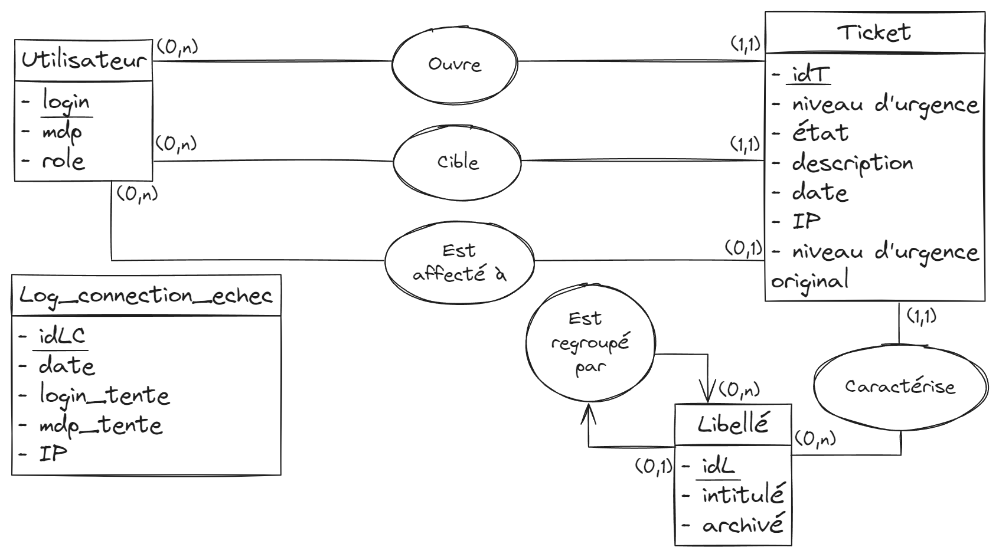
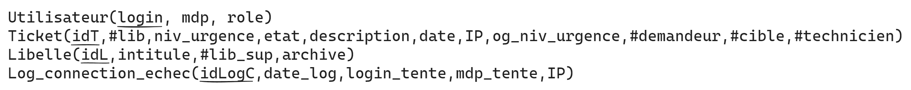

# SAE 3.01 - Conception

## Sommaire

* [**Chapitre 1**](#intro) **:** _Introduction_
* [**Chapitre 2**](#part1) **:** _Approche_
* [**Chapitre 3**](#part2) **:** _Conception architecturale_
* [**Chapitre 4**](#part3) **:** _Conception de la base de données_
* [**Chapitre 5**](#part4) **:** _Conception des pages dynamiques_

## Introduction

Ce document détaille comment le projet a été implémenté et conçu. Il détaillera les différentes vues de la structure du projet,
ainsi que les comportements de ce dernier vis à vis des utilisateurs. Pour voir les spécifications à suivre, consultez le

**Dossier de Spécifications** _(Annexe 3)_.

## Approche

### Introduction

Dans le cadre de notre projet, nous adoptons une approche orientée objet. Nous verrons tout d'abord en quoi elle 
consiste puis pourquoi nous l'avons choisi et enfin comment nous l'avons implementé dans notre projet.

### Définition

L'approche orienté objet se divise en quatre étapes :

- **Abstraction**
- **Encapsulation**
- **Classification**
- **Polymorphisme**

**Abstraction :** L'abstraction est le processus de simplification d'un objet ou d'un concept en identifiant uniquement les 
caractéristiques et les comportements essentiels, tout en ignorant les détails non pertinents. Elle permet de se 
concentrer sur l'essentiel pour mieux comprendre et représenter un objet. Par exemple, lors de la modélisation d'un 
système de ticketing, on pourrait abstraire un "événement" pour inclure uniquement les propriétés essentielles, telles 
que le nom, la date et le lieu, en ignorant les détails complexes.

**Encapsulation :** L'encapsulation consiste à regrouper les données (attributs) et les méthodes (fonctions) qui opèrent sur
ces données en une seule unité, appelée classe. Cette unité limite l'accès direct aux attributs.

**Classification :** La classification, permet de créer de nouvelles classes en se basant sur des classes existantes. 
Par exemple, si l'abstraction le suggère, les classes "Romans" et "BD" peuvent être fusionnées en une classe nommée 
"Ouvrages".

**Polymorphisme :** Le polymorphisme signifie que différentes classes peuvent répondre de manière différente aux mêmes 
messages ou aux mêmes méthodes. Il permet de traiter des objets de classes différentes de manière uniforme. Par exemple,
dans un système de ticketing, vous pourriez avoir une méthode "acheterTicket" qui peut être invoquée sur différentes 
classes de tickets, mais qui se comportera de manière spécifique en fonction du type de ticket.

### Motivation

En utilisant cette méthodologie, nous pouvons représenter les différents composants de notre service de ticketing sous
forme d'objets, ce qui facilite la gestion des données, des interactions et des opérations. 
Cela nous permet de modéliser notre système de manière plus organique et efficace. Cette approche nous offre une plus 
grande modularité, une réutilisation du code plus efficace et une maintenance simplifiée, tout en rendant notre 
architecture plus flexible pour les futures évolutions du projet. En intégrant les principes de l'approche orientée 
objet, nous sommes convaincus que notre système de ticketing sera plus cohérent, plus extensible et plus facile à gérer.

### Implémentation

Chaque composant, tel que les utilisateurs, les événements, les billets et les transactions, sera représenté comme une 
classe d'objet distincte, avec des attributs et des méthodes spécifiques.

## Conception architecturale

### Diagramme de composant livrable 2

## Conception de la base de données

### Modèle conceptuel des données (MCD) :

### Modèle logique des données (MLD) :

Comme montré sur ce modèle, nous avons regroupé les objets du problème à stocker en cinq tables :

|Table|Explication|
|-|-|
|**Utilisateur**|La table Utilisateur est l'abstraction des comptes utilisateurs. Elle contient le login et le mot de passe nécessaires pour se connecter à son compte utilisateur, ainsi qu'un champ "role" permettant de définir si le compte est celui d'un Utilisateur, d'un Administrateur Système, d'un Technicien ou d'un Administrateur Web. Le login sert de clé primaire pour cette table, ce qui veut dire qu'un utilisateur souhaitant créer un compte ne peut pas choisir un login déjà existant. Le champ mdp ne peut pas être nul, et un champ role nul indique un compte utilisateur. (pas technicien ou admin)|
|**Ticket**|La table Ticket est l'abstraction des tickets et des journaux d'activité de tickets créés. Elle contient un identifiant de ticket, un niveau d'urgence (pouvant aller de 1 à 4), un état (pouvant être Ouvert, En cours de traitement ou Fermé), et une description. Pour la partie log, elle possède un champ date, correspondant à sa date de création, un champ IP, correspondant à l'adresse IP qui a généré le ticket, et le niveau d'urgence original tel qu'il a été renseigné par l'utilisateur. Elle possède également une clé étrangère correspondant à un identifiant de libellé, dont le champ est "lib", et trois clés étrangères, toutes correspondant à un identifiant utilisateur. "demandeur" corresponds à l'identifiant du compte utilisateur ayant ouvert le ticket et ne peut pas être nul. "cible" corresponds à l'identifiant du compte utilisateur renseigné en tant que personne concernée et ne peut pas être nul. Il sera défini comme étant le demandeur si rien n'a été renseigné dans le formulaire. Enfin, "technicien" : Corresponds à l'identifiant du compte utilisateur technicien à qui est affecté le ticket.|
|**Libelle**|La table Libelle est l'abstraction des libellés et des natures de tickets. Elle contient un identifiant de libellé (utilisé dans la table Ticket pour déterminer le libellé utilisé), un intitulé contenant le texte du libellé, et un booléen archive indiquant si le libellé a été supprimé ou non. En effet on ne peut pas directement supprimer des libellés de la base de données car des tickets encore ouverts pourraient les utiliser. Un tel booléen permets donc de savoir si un libellé est disponible ou non. Enfin, un libellé a une clé étrangère avec lui même, afin d'implémenter le système de sous-libellés. Cette clé étrangère a pour champ "lib_sup" et contient l'identifiant du libellé supérieur à celui-ci.|
|**Log_connexion_echec**|La table Log_connexion_echec est l'abstraction des journaux de connexions échouées. Lorsqu'une connexion à un compte utilisateur est tentée sur le site et qu'elle est infructueuse, une entrée est faite dans cette table. Elle contient un identifiant d'entrée, la date de la tentative de connexion, le login et le mot de passe tentés, ainsi que l'adresse IP ayant tenté de se connecter à un compte. Il est à noter que le login et le mot de passe ne correspondent pas nécessairement à un login ou un mot de passe existants dans la base de données.|

### Explications supplémentaires :

Nous aimerions expliquer quelques points supplémentaires sur le modèle de base de données utilisé. En particulier, la raison pour laquelle nous stockons les journaux d'activités dans cette base plutôt que sur un fichier système. Tout d'abord, centraliser le stockage des données sur une même base évite d'éparpiller les données et permets d'avoir un accès plus facile à ces dernières. Mais surtout, cela permets des comparaisons faciles entre les données des journaux et les données du modèle. C'est notamment pour cela que, bien que la table **Log_connexion_echec** n'ait aucune relation avec d'autres tables, elle n'en reste pas moins légitime.

Par exemple, il est possible en mettant ces journaux sous la forme de tables de regarder si le login tenté dans le journal d'activité de connexions échouées corresponds bien à un login existant dans la table **Utilisateur**. Si c'est le cas, il pourrait s'agir d'un simple oubli de mot de passe. Ou encore, si on voit beaucoup de lignes correspondant à cette requête, on peut suspecter une tentative d'attaque. 

Il nous semble également important d'expliquer l'absence d'une table **Log_tickets_valides**. Le fait est qu'un journal d'activité de ticket est intrinsèquement lié à son ticket. Ces deux entités sont créées simultanément, partagent des informations similaires telles que la date ou le niveau d'urgence, et peuvent être récupérées sous forme de journal assez aisément à travers une vue. Du point de vue de la conception et de la cohérence des données, la décision a été prise de fusionner les tables **Ticket** et **Log_Tickets_Valides** en une unique table **Ticket**.

## Conception des pages dynamiques

### Introduction
Pour les pages dynamiques, nous avons décidé d'utiliser du PHP objet afin de rendre le code plus modulaire, lisible et efficace. Les différentes classes que nous allons utiliser permettront d'éviter l'usage de fonctions éparpillées dans des modules, et plutôt utiliser des méthodes d'objets, plus claires et plus pratiques d'utilisation. Un autre avantage à utiliser l'objet est que les objets peuvent être sérialisés, assurant ainsi la protection des données stockées dans ces derniers. Enfin, utiliser des méthodes pour accéder à la base de données limite les possibilités d'abus d'accès à la base.  
La conception a été précédée d'un prototype preuve du concept et est donc sensible et intimement liée à son implémentation.  
Vous verrez ci-dessous un diagramme de classe commenté.

### Diagramme de classe

### Explications

#### Client

Tout est centré autour de la classe Client, qui est une généralisation des utilisateurs physiques ou virtuels de la plateforme. Chaque Client possède un identifiant et un mot de passe permettant de se connecter à un compte de la base de données. Cette connection est également stockée dans la classe Client, et elle possède des champs statiques contenant l'hôte et le nom de la base de données afin de pouvoir s'y connecter ou reconnecter. Cette classe surcharge les méthodes dites "magiques" de sérialisation pour qu'une instance soit transmise d'une page à l'autre dans la session PHP. Interfaçant avec la base, elle met à disposition des méthodes de requête.  
C'est une classe abstraite, ce qui veut dire que d'autres types d'utilisateurs plus précis et avec des méthodes supplémentaires hériteront de ses caractéristiques.

#### Client virtuel et visiteur

Chaque utilisateur non connecté se verra attribué un objet `Visiteur` hérité de Client avec des méthodes restreintes pour afficher la page d'accueil. Une escalade de privilèges liée à la connexion d'un utilisateur est représentée par la méthode `connecte` renvoyant un Client de la classe fille correspondante à son role dans la base ; c'est l'équivalent d'un objet `Factory` en *Factory Design Pattern*.  
La classe Système représente un visiteur virtuel et permet simplement d'ajouter des utilisateurs, ayant les droits nécessaires dans la base de donnée.  

Ces deux classes surchargent le constructeur de Client pour utiliser des identifiants statiques puisqu'elles sont reliées à un seul utilisateur MySQL chacune.

#### Compte et AccesseurLibellé

La classe Compte est l'abstraction d'un utilisateur connecté. Non-instanciable, elle généralise les différents rôles d'utilisateurs : Utilisateur, Technicien, AdminSys, AdminWeb. Chaque rôle, comme Visiteur, est équippé de méthodes pour afficher sa page respective et effectuer ses opérations permises dans la base de données et dérivées du dossier de spécifications. Bien que n'ayant qu'une méthode, elle s'avère utile pour différencier un utilisateur connecté d'un utilisateur non-connecté.  
AccesseurLibellé héritant de cette classe contient une méthode publique de récupération de libellés partagée entre deux rôles. 

#### Erreurs

Notre conception permet d'identifier les deux sujets d'erreur rencontrés dans le fonctionnement de cette structure : la connexion à la base de données et le résultat des requêtes. Nous avons représenté ces deux sujets par les classes ConnexionImpossible et RequêteIllégale, surchargeant le constructeur pour indiquer la nature de l'erreur et héritant d'une classe réservée à toutes nos erreurs "maison" (relatives à notre système), ErreurBD. Ainsi, il est possible de prendre en charge les erreurs intentionnelles du système tout en laissant les erreurs inattendues interrompre le chargement des pages pour nous être directement visibles.