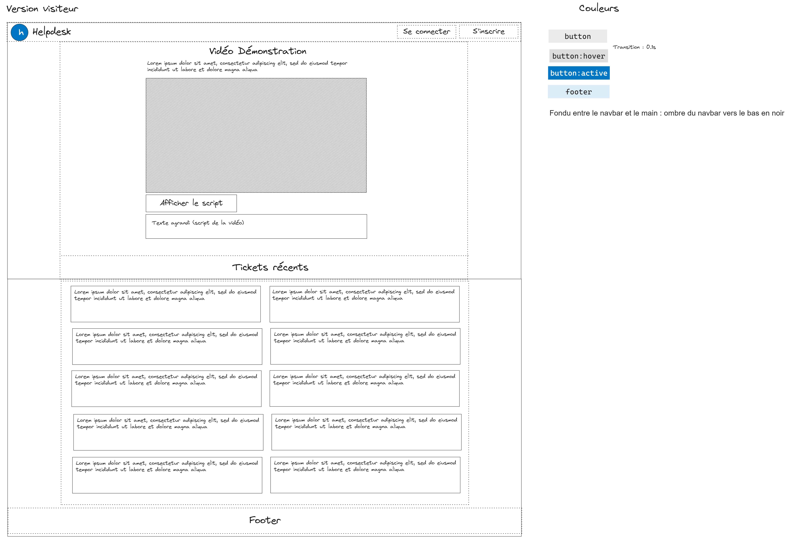
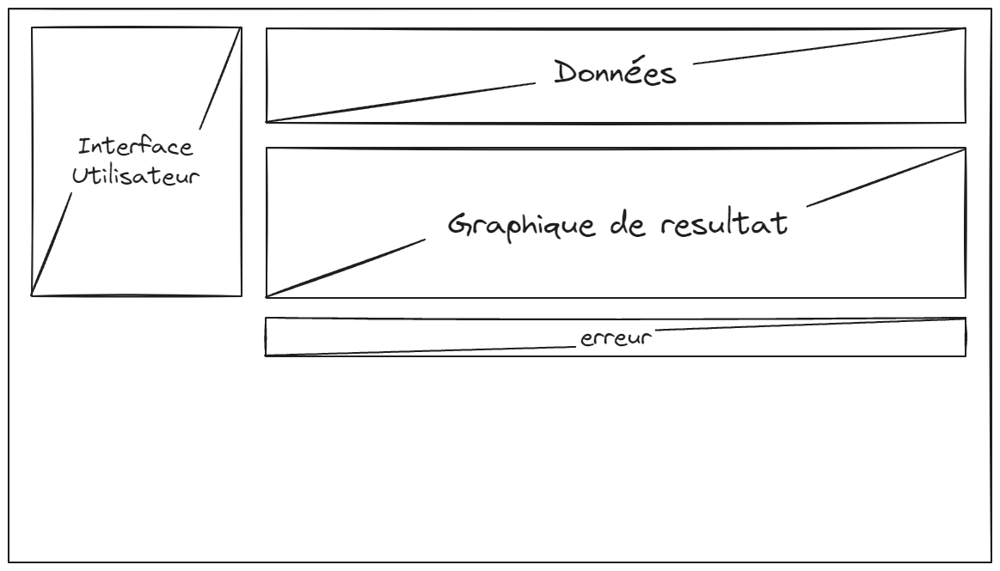

# Dossier de test
Version : 0.2

| Document                    | Dossier de test  |
| --------------------------- | ---------------- |
| Date                        | 21/10/2023       |
| Responsable de la rédaction | Baptiste Fournié |

## Dossier de tests

### Introduction
Ce document est un dossier de tests pour le projet de plateforme de ticketing interne. Les objectifs de chaque livrables sont:

* Les objectifs du premier livrable sont de faire une maquette des pages de l'application web et de vérifier si les pages HTML ressemblent aux maquettes graphiques. 
* Les objectifs du second livrable sont de créer la base de données pour l'application web et de vérifier si la base de données est opérationnelle (Les tests sont dans le dossier src/bd).
* Les objectifs du troisiéme livrable sont de faire les pages dynamiques de l'application web grâce aux maquettes du premier livrable, de faire une étude analytique sur les données de l'application web et de vérifier si les outils pour réaliser l'étude sont opérationnels .

### Description de la procédure de test
Pour le premier livrable, les tests seront des tests d'intégration visuels. Ils consisteront à comparer le visuel de la page web à la maquette graphique et de voir si elles sont identiques. Donc il n'y aura de partition.
Pour le second livrable, les tests de la base de données font partie intégrantes des différents fichiers SQL dans la section bd.
Pour le troisiéme  livrable, les tests seront des tests unitaires en utilisant la méthode des boites noires pour tout ce qui est du backend . Pour le fronted, le test sera un test d'intégration visuels.
### Description des informations à enregistrer pour les tests

## **1. Campagne de test**
    
### **1.1 Livrable 1**

| Paramètre                          | Valeur                                               |
| ---------------------------------- | ---------------------------------------------------- |
| Produit testé                      | Site web                                             |
| Configuration logicielle           | Webstorm, Windows 10                                 |
| Configuration matérielle           |                                                      |
| Date de début                      | 18/09/2023                                           |
| Date de finalisation               | 27/10/2023                                           |
| Tests à appliquer                  | Test d'intégration visuel sur la page d'accueil.     |
|                                    | Test d'intégration visuel sur la page d'inscription. |
| Responsable de la campagne de test | Baptiste Fournié                                     |

### **1.2 Livrable 3**

| Paramètre                          | Valeur                                    |
| ---------------------------------- | ----------------------------------------- |
| Produit testé                      | etude analytique                          |
| Configuration logicielle           | Rstudio, Windows 10                       |
| Configuration matérielle           |                                           |
| Date de début                      | 7/11/2023                                 |
| Date de finalisation               | 27/11/2023                                |
| Tests à appliquer                  | Test d'intégration R                      |
|                                    |                                           |
| Responsable de la campagne de test | Baptiste Fournié, Lucas Da silva Ferreira |

### **1.3 Livrable 4**

| Paramètre                          | Valeur                                |
| ---------------------------------- | ------------------------------------- |
| Produit testé                      | APIv2                                 |
| Configuration logicielle           | Visual Studio Code, Windows 10, WSL   |
| Configuration matérielle           |                                       |
| Date de début                      | 24/03/2024                            |
| Date de finalisation               | 26/03/2024                            |
| Tests à appliquer                  | Test d'intégration de la nouvelle API |
|                                    |                                       |
| Responsable de la campagne de test | Lucas Da silva Ferreira               |

## **2. Tests**

### **2.1 Livrable 1**

| Paramètre              | Valeur                                           |
| ---------------------- | ------------------------------------------------ |
| Identification du test | Page d'accueil                                   |
| Description du test    | Test d'intégration visuel sur la page d'accueil. |
| Ressources Requises    |                                                  |
| Responsable            | Baptiste Fournié                                 |

On compare l'image de la maquette web de la page d'accueil à la page d'accueil statique du site web.
La maquette web est la suivante :

| Paramètre              | Valeur                                               |
| ---------------------- | ---------------------------------------------------- |
| Identification du test | page accueil                                         |
| Description du test    | Test d'intégration visuel sur la page d'inscription. |
| Ressources Requises    |                                                      |
| Responsable            | Baptiste Fournié                                     |

On compare l'image de la maquette web de la page d'inscription à la page d'inscription statique du site web.
La maquette web est la suivante :

### **2.2 Livrable 3**

| Paramètre                             | Valeur                                                                                  |
| ------------------------------------- | --------------------------------------------------------------------------------------- |
| Identification du test : calcul_proba | version 0.5                                                                             |
| Description du test                   | Test Unitaire sur la fonction "calcul_proba" en utilisant la méthode des boites noires. |
| Ressources Requises                   | Rstudio                                                                                 |
| Responsable                           | Baptiste Fournié                                                                        |

Choix de partition: On considére que la plage de date est correcte car elle est sera vérifié quand l'utilisateur fera le choix, le libéllé peut etre divisé en 3 sous ensembles : all qui veut dire tous les tickets, un libéllé inexistant, un libéllé qui n'est pas dans le vecteur libélle valide et un libéllé existant qui est dans le vecteur libélle valide

| Classe |      Libéllé       |                                     Résultat attendu                                     |
| :----: | :----------------: | :--------------------------------------------------------------------------------------: |
|   P0   |        all         |                                            1                                             |
|   P1   | libélle inexistant |                                            0                                             |
|   P2   |  libélle existant  | nb tickets possédant le libéllé dans la plage de date / nb tickets dans la plage de date |

| Classe |        libéllé         |  Résultat  |
| :----: | :--------------------: | :--------: |
|   P0   |          all           |     1      |
|   P1   | manger une choucroutte |     0      |
|   P2   |   Problème logiciel    | 2/10 = 0,2 |

on considére qu'il y a 10 tickets et que la plage des dates prend toute l'année

| Paramètre                              | Valeur                                                                                   |
| -------------------------------------- | ---------------------------------------------------------------------------------------- |
| Identification du test : calcul_nombre | version 0.5                                                                              |
| Description du test                    | Test Unitaire sur la fonction "calcul_nombre" en utilisant la méthode des boites noires. |
| Ressources Requises                    | Rstudio                                                                                  |
| Responsable                            | Baptiste Fournié                                                                         |

Choix de partition: On considére que la plage de date est correcte car elle est sera vérifié quand l'utilisateur fera le choix, la plage des dates peut etre divisé en 2 sous ensembles : soit la plage date fait un mois donc une seul ligne dans le data frame soit la plage datez comporte plusieurs mois donc il y aura plusieurs lignes dans le data frame. Le libéllé peut etre divisé en 3 sous ensembles: all qui veut dire tous les tickets, un libéllé inexistant, un libéllé qui n'est pas dans le vecteur libélle valide et un libéllé existant qui est dans le vecteur libélle valide

| Classe |      Libéllé       |         Plage date         |                                  Résultat attendu                                   |
| :----: | :----------------: | :------------------------: | :---------------------------------------------------------------------------------: |
|   P0   |        all         |           1 mois           |                           nombre de tickets dans ce mois                            |
|   P1   |        all         |       plusieurs mois       |           nombre de tickets pour chaque  mois present dans la plage date            |
|   P2   | libélle inexistant | Quelque soit la plage date |                    0 pour chaque mois présent dans la plage date                    |
|   P3   |  libélle existant  |           1 mois           |                 nombre de tickets possédant ce libéllé dans ce mois                 |
|   P4   |  libélle existant  |       plusieurs mois       | nombre de tickets possédant ce libéllé pour chaque  mois present dans la plage date |

| Classe |        Libéllé         |    Plage date     |    Résultat attendu    |
| :----: | :--------------------: | :---------------: | :--------------------: |
|   P0   |          all           |      janvier      |      janvier : 2       |
|   P1   |          all           | janvier à fevrier | janvier : 2, fevrier 2 |
|   P2   | manger une choucroutte |      janvier      |      janvier : 0       |
|   P3   |   Problème logiciel    |      janvier      |      janvier : 1       |
|   P4   |   Problème logiciel    | janvier à fevrier | janvier : 1, fevrier 1 |

On considére qu'il y a 12 tickets et que chaque mois posséde 1 ticket problème logiciel et un autre.

| Paramètre                                   | Valeur                                                                                        |
| ------------------------------------------- | --------------------------------------------------------------------------------------------- |
| Identification du test : calcul_loi_Normale | version 0.5                                                                                   |
| Description du test                         | Test Unitaire sur la fonction "calcul_loi_Normale" en utilisant la méthode des boites noires. |
| Ressources Requises                         | Rstudio                                                                                       |
| Responsable                                 | Baptiste Fournié                                                                              |

Choix de partition: On considére que la moyenne et l'ecart type  est égale ou supérieur à 0. Le data frame contenant le nombre de tickets par mois peut etre divisé en 2 sous ensembles : soit il n'y a qu'une seul valeur dans le data frame soit il y en a plusieurs . Dans résultat attend loi1N signifie les valeurs comprise entre moyenne - écart type et moyenne + écart  type. et loi2N signifie les valeurs comprise entre moyenne - écart type et moyenne + écart  type

| Classe |     dataFrame      |                  Résultat attendu                   |
| :----: | :----------------: | :-------------------------------------------------: |
|   P0   |  une seule valeur  |                Loi1N = 10 loi2N = 1                 |
|   P1   | pluesieurs valeurs | loi1N = [moy-sd, moy+sd] loi2N = [moy-2sd, moy+2sd] |

| Classe |            dataFrame             |     Résultat attendu      |
| :----: | :------------------------------: | :-----------------------: |
|   P0   |           janvier : 2            |  Loi1N = 100 loi2N = 100  |
|   P1   | janvier : 3, fevrier 2, mars : 0 | loi1N = 100/3  loi2N =100 |

| Paramètre              | Valeur                                                                         |
| ---------------------- | ------------------------------------------------------------------------------ |
| Identification du test | Interface graphique                                                            |
| Description du test    | Test d'intégration visuel sur l'interface graphique sur l'analyse des tickets. |
| Ressources Requises    |                                                                                |
| Responsable            | Lucas Da Silva Ferreira                                                        |

Pour l'interface nous allons refaire les tests faits précedemment et voir s'ils retournent bien les mêmes résultats (seuls les classes avec libéllé inexistant ne seront pas faites car dans l'interface graphique, l'utilisateur ne peut que choisir des libéllés existants). 

Prévision :

Résultat :

### **2.3 Livrable 4**

| Paramètre                            | Valeur                                                                                |
| ------------------------------------ | ------------------------------------------------------------------------------------- |
| Identification du test : inscription | version 1.0                                                                           |
| Description du test                  | Test unitaire sur la méthode inscription de la classe Visiteur, méthode boite blanche |
| Ressources Requises                  | Visual Studio Code, WSL                                                               |
| Responsable                          | Lucas DA SILVA FERREIRA                                                               |

**Chemins :**

- C1 : 1-2
- C2 : 1-3-4
- C3 : 1-3-5

Admettons que l'utilisateur "MDufaud" est déjà présent sur la base de données.

| Chemin | id : string | mdp : string |                        Résultat                        |
| :----: | :---------: | :----------: | :----------------------------------------------------: |
|   C1   |   MDufaud   |   dgtsgfs    | RequeteIllégale("Le Login MDufaud est déjà utilisé",2) |
|   C1   |     ""      |   dgtsgfs    |            RequeteIllégale("Login vide",2)             |
|   C2   |   MHoffer   |   fsdfsdf    |               Creation du Compte MHoffer               |

| Paramètre                            | Valeur                                                                                   |
| ------------------------------------ | ---------------------------------------------------------------------------------------- |
| Identification du test : ajoutTicket | version 1.0                                                                              |
| Description du test                  | Test unitaire sur la méthode ajoutTicket de la classe Utilisateur, méthode boite blanche |
| Ressources Requises                  | Visual Studio Code, WSL                                                                  |
| Responsable                          | Lucas DA SILVA FERREIRA                                                                  |
  

**Chemins :**

- C1 : 1-2
- C2 : 1-3-4
- C3 : 1-3-5-6
- C4 : 1-3-5-7-8
- C5 : 1-3-5-7-9

| Chemin | lib | niv_urgence | desc              | cible     | Résultat attendu                                               |
| ------ | --- | ----------- | ----------------- | --------- | -------------------------------------------------------------- |
| C1     | ""  | 1           | "Problème X"      | "user1"   | RequêteIllégale("Le champ d'intitulé du libellé est vide.", 1) |
| C2     | 999 | 2           | "Problème Y"      | "user2"   | RequêteIllégale("Le libellé n'existe pas.", 2)                 |
| C3     | 1   | 5           | "Problème Z"      | "user3"   | RequêteIllégale("Le niveau d'urgence est incorrect.", 3)       |
| C4     | 2   | 1           | "Autre problème"  | "user999" | RequêteIllégale("Cible introuvable.", 4)                       |
| C5     | 1   | 2           | "Problème résolu" | "user1"   | Succès, ticket ajouté                                          |

| Paramètre                         | Valeur                                                                             |
| --------------------------------- | ---------------------------------------------------------------------------------- |
| Identification du test : connecte | version 1.0                                                                        |
| Description du test               | Test unitaire sur la méthode connecte de la classe Visiteur, méthode boite blanche |
| Ressources Requises               | Visual Studio Code, WSL                                                            |
| Responsable                       | Lucas DA SILVA FERREIRA                                                            |

**Chemins :**

- C1 : 1-2
- C2 : 1-3-4
- C3 : 1-3-5-6
- C4 : 1-3-5-7-8
- C5 : 1-3-5-7-9

| Chemin | id : string | mdp : string  | Résultat attendu                                                    |
| ------ | ----------- | ------------- | ------------------------------------------------------------------- |
| C1     | "user999"   | "mdp"         | ConnexionImpossible("Échec de connexion - utilisateur non trouvé.") |
| C2     | "user1"     | "wrong_mdp"   | ConnexionImpossible("Mot de passe invalide.")                       |
| C3     | "user2"     | "mdp"         | ConnexionImpossible("Rôle non existant.")                           |
| C4     | "user3"     | "mdp"         | ConnexionImpossible("Rôle non reconnu.")                            |
| C5     | "user1"     | "mdp_correct" | Connexion réussie, retour d'objet Client correspondant              |

| Paramètre                              | Valeur                                                                                    |
| -------------------------------------- | ----------------------------------------------------------------------------------------- |
| Identification du test : assigneTicket | version 1.0                                                                               |
| Description du test                    | Test unitaire sur la méthode assigneTicket de la classe Technicien, méthode boite blanche |
| Ressources Requises                    | Visual Studio Code, WSL                                                                   |
| Responsable                            | Lucas DA SILVA FERREIRA                                                                   |

**Chemins :**

- C1 : 1-2
- C2 : 1-3-4
- C3 : 1-3-5-6
- C4 : 1-3-5-7

| Chemin | id : string | Résultat attendu                                                                      |
| ------ | ----------- | ------------------------------------------------------------------------------------- |
| C1     | 999         | RequêteIllégale("L'utilisateur n'existe pas.")                                        |
| C2     | "user2"     | RequêteIllégale("Rôle invalide. Seuls les techniciens peuvent assigner des tickets.") |
| C3     | 998         | RequêteIllégale("Le ticket n'existe                                                   |

## **3. Résultats de test**

### **3.1 Livrable 1**

| Référence du test appliqué | Responsable      | Date de l'application du test | Résultat du test | Occurrences des résultats |
| -------------------------- | ---------------- | ----------------------------- | ---------------- | ------------------------- |
| Page d'accueil             | Baptiste Fournié | 22/10/2023                    | OK               | Systématique              |
| Page d'inscription         | Baptiste Fournié | 22/10/2023                    | OK               | Systématique              |

### **3.2 Livrable 3**

| Référence du test appliqué | Responsable      | Date de l'application du test | Résultat du test | Occurrences des résultats |
| -------------------------- | ---------------- | ----------------------------- | ---------------- | ------------------------- |
| calcul proba               | Baptiste Fournié | 27/12/2023                    | OK               | Systématique              |
| calcul nombre              | Baptiste Fournié | 27/12/2023                    | OK               | Systématique              |
| calcul_loi_normale         | Baptiste Fournié | 27/12/2023                    | OK               | Systématique              |
| Interface graphique proba  | Baptiste Fournié | 27/12/2023                    | OK               | Systématique              |

### **3.3 Livrable 4**

| Référence du test appliqué | Responsable             | Date de l'application du test | Résultat du test | Occurrences des résultats |
| -------------------------- | ----------------------- | ----------------------------- | ---------------- | ------------------------- |
| inscription                | Lucas DA SILVA FERREIRA | 25/03/2024                    |     FAIT         | PASSED                    |
| ajoutTicket                | Lucas DA SILVA FERREIRA | 25/03/2024                    |     FAIT         | PASSED                    |
| connecte                   | Lucas DA SILVA FERREIRA | 25/03/2024                    |     FAIT         | PASSED                    |
| assigneTicket              | Lucas DA SILVA FERREIRA | 25/03/2024                    |     FAIT         | PASSED                    |

## **4. Conclusion**

Les pages du site web ressemblent à leur maquette graphique et les outils de l'étude analytique sont opérationels. Le dossier tests sera mis à jour lors du livrable 4.
