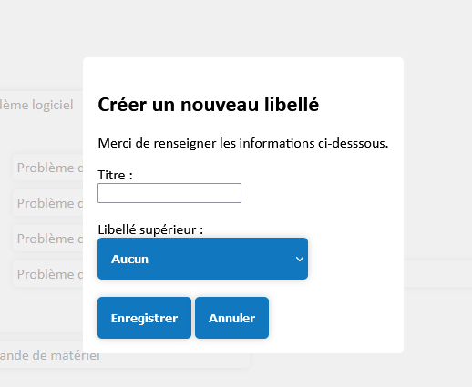

# Notice d'utilisation du site

## Sommaire<!-- omit from toc -->

- [Notice d'utilisation du site](#notice-dutilisation-du-site)
  - [Site principal](#site-principal)
    - [Utilisation du site](#utilisation-du-site)
      - [I - Utilisation générale](#i---utilisation-générale)
      - [Utilisateur lambda](#utilisateur-lambda)
      - [Technicien](#technicien)
      - [Administrateur web](#administrateur-web)
      - [Administrateur système](#administrateur-système)
  - [Installation du site](#installation-du-site)
    - [Matériel nécessaire :](#matériel-nécessaire-)
    - [Installation du Raspberry :](#installation-du-raspberry-)


## Site principal

### Utilisation du site

#### I - Utilisation générale

La page principale du site se présente comme suit :


La vidéo de démonstration est un autre outil permettant à un utilisateur lambda d'apprendre à utiliser le site.
Le logo et le titre de l'application en haut à gauche permettent de revenir à cette page d'accueil à tout moment.

Sous la vidéo se trouve une liste des 10 tickets les plus récents :


Ces tickets sont là à titre informatif. Ainsi, vous pouvez vérifier avant de vous connecter que le ticket que vous
souhaitez reporter n'a pas déjà été entré par une autre personne.

Cliquer sur le bouton d'Inscription vous amène à cette page :


Ici, cliquer sur Accueil ramène à la page d'accueil précédente. Ce formulaire vous permet de créer votre compte afin
de pouvoir utiliser la plateforme. Un captcha vous sera demandé. Voici un exemple de remplissage de ce formulaire :


Une fois rempli, vous pouvez cliquer sur S'inscrire, et vous serez redirigé sur votre page utilisateur.

Un autre moyen de s'y rendre est de cliquer sur le bouton Connexion sur la page d'inscription ou sur la page d'accueil.
Ce qui vous amènera à cette page :


Ce formulaire vous permet de vous connecter au compte que vous venez de créer. Si vous avez déjà créé un compte, mais avez
oublié votre mot de passe, vous pouvez cliquer sur le lien "Mot de passe oublié" qui vous amènera à cette page :


Une fois le formulaire de connection rempli, si vous avez mis les identifiants corrects, vous serez redirigé vers la page
utilisateur.

#### Utilisateur lambda

Une fois connecté à votre compte, vous serez redirigé sur votre page d'accueil personnalisée :


Ici, vous avez deux grandes catégories. La première concerne les tickets que vous avez créés qui sont encore ouverts,
n'ayant pas encore été clôturés. La deuxième concerne les tickets que vous avez créés ayant étés clôturés.

Le bouton Profil en haut à droite vous montre votre login.


Le bouton Déconnexion vous déconnecte de votre compte et vous ramène à la page d'accueil visiteur. Enfin, le bouton Créer
un ticket vous ouvre un formulaire vous permettant d'entrer un ticket, comme suit :


Ici, vous pouvez sélectionner un Libellé parmi une séléction prédéfinie de proposition. Ce libellé permettra aux techniciens
et aux administrateurs de facilement discerner quel type de problème vous voulez reporter. Au moment où ce document est rédigé,
voici la liste des libellés qui apparaît lorsque l'on clique sur la liste déroulante :


Une fois un libellé sélectionné, vous pouvez ensuite estimer le niveau d'urgence de votre ticket. Notez que ce niveau d'urgence
est sujet à changement. Par défaut, et au moment d'écrire ce document, il y a 4 niveaux d'urgences sélectionnables :


Vous pouvez ensuite entrer une description de votre problème dans le champ suivant. Le dernier champ concerne les demandes que
vous faites pour d'autres utilisateurs, par exemple une récupération de session. Pour cela, vous pouvez indiquer le login de
l'utilisateur cible. Par défaut, vous êtes considérés comme la cible de votre propre ticket.


Une fois le formulaire complété correctement, vous pouvez cliquer sur Annuler pour annuler votre demande, ou sur Enregistrer
pour valider votre entrée de Ticket. Une fois validé, le ticket apparaîtra dans votre liste de tickets ouverts :


Une fois clôturé, il rejoindra de la même manière votre liste de tickets fermés.

#### Technicien

Pour vous connecter en tant que Technicien au site, vous devez vous connecter avec un compte Technicien. Ces derniers ont des
logins spécifiques définis par l'administrateur web. Lors de l'installation initiale du site ou de la réinitialisation de la base de données, les logins de technicien suivants vous sont disponibles :
- megatech (mot de passe "megatech")

Nous vous invitons à communiquer avec votre administrateur système pour ajouter votre compte à cette liste.

En se connectant depuis la page de connexion, le technicien arrivera sur cette page :


Ici, vous avez deux grandes catégories. La première concerne les tickets qui vous ont été attribués, et que vous devez régler
puis clôturer. La deuxième concerne les tickets encore ouverts et pas encore attribués à un technicien. Nous verrons plus loin comment vous en attribuer un.

Le bouton Profil en haut à droite vous montre votre login.


Le bouton Déconnexion vous déconnecte de votre compte et vous ramène à la page d'accueil visiteur.

Le Technicien a pour possibilité de s'auto-attribuer des tickets, et de fermer ceux qui lui sont attribuer. Pour faire cette
première tâche, il est possible pour vous de cliquer sur un ticket dans la liste des Tickets Non Attribués pour ouvrir une
fenêtre :


Cliquer sur Annuler ferme la fenêtre sans rien changer, et cliquer sur Confirmer vous affecte le ticket et l'affiche dans votre
liste de tickets attribués.


Il est possible de cliquer sur les tickets dans cette catégorie pour ouvrir une autre fenêtre :


Ce qui archivera le ticket et le supprimera définitivement de la liste.


#### Administrateur web

Le ou les administrateur(s) web du site ont aussi leur compte qui est créé directement en base de données. Par défaut, un compte est disponible :
- adminweb (mot de passe "adminweb")

En vous connectant sur la page de connexion vous arriverez sur la page suivante :


Comme vous pouvez le voir, cette page a deux parties. La première partie vous présente un nuage de libellés cliquables :

Ce sont tous les libellés disponibles non archivés.

La seconde partie est une liste de tickets cliquables également :


Ce sont les tickets actuellement ouverts ou en cours de traitement.

Cliquer sur un libellé vous présentera un dialogue de modification de ce libellé :


Vous pourrez sélectionner un libellé supérieur (libellé qui contiendra le libellé en cours de modification) :


Dans cet exemple, le résultat est le suivant :


Vous pouvez également archiver le libellé pour qu'il ne soit plus ni affiché ni disponible pour les utilisateurs. C'est comme s'ils étaient supprimés sauf qu'ils sont toujours en base (pas de panique donc) :


Cliquer sur un ticket vous donnera aussi un dialogue de modification :


On peut alors assigner ou réassigner le technicien d'un ticket :


Dans cet exemple, le résultat est le suivant :


Ensuite, vous verrez que le menu en haut de la page vous permet plus d'actions :


Vous pouvez ajouter un libellé :



Ou un technicien dans la base :


Cet ajout prend effet immédiatement et permet au nouveau technicien de se connecter à la plateforme à son tour pour prendre en charge et cloturer des tickets.

#### Administrateur système

L'administrateur système est aussi un type de compte dont la création se fait directement en base de données. Un utilisateur vous est fourni avec la plateforme :
- adminsys (mot de passe "adminsys")

En se connectant, on arrive sur cette page :


Vous pouvez voir trois sections dans cette page correspondant aux trois types de log. Le log des connexions échouées recense toutes les connexions échouées dont le login ou le mot de passe est incorrect :


Le log des tickets validés recense les informations de tous les tickets ayant été validés (clos par un technicien) :


Le log des états des tickets donne l'état actuel de chaque ticket en plus d'informations sur le ticket.


Le menu en haut de la page vous permet de vous déconnecter, consulter votre profil et accéder à une page de statistiques de la plateforme :


Enfin, il vous est possible de télécharger tous les logs un à un en utilisant les boutons avec une flèche vers le bas :


Vous aurez ainsi un fichier CSV avec toutes les valeurs des logs que vous pourrez utiliser tel quel ou parser avec votre langage de scripting favori.

## Installation du site

### Matériel nécessaire :
Carte SD + Raspberry + Clavier + Ecran + (Cable HDMI - micro HDMI) + Cable RJ45 (optionnel) + Alimentation 5V 3A

### Installation du Raspberry :
Après que tous les branchements soient effectués, dès que l’alimentation est branchée à la raspberry, elle s’allumera toute seule. Après le démarrage vous serez sur une invite de commande déjà connecté sous l’utilisateur `p6nj`, dès ce moment vous pourrez faire la configuration réseau via les commandes `ip`, ou l’utilitaire `nmtui`, ou bien pour du wireless via `iwconfig` ou les autres commandes en `iw-`. Référez-vous aux pages man pour plus d'informations. La raspberry sera en permanence accessible en ssh via le port `22` avec le login et le mot de passe qui sera fourni dans le fichier `mdp`. Pour la connexion sur cet utilisateur `sshpass` va nous permettre de nous connecter en `ssh` sans afficher ni connaitre le mot de passe. Avec la commande ci-dessous, la connexion sera possible sur cet utilisateur :
```sshpass -fmdp ssh p6nj@heaven.local```
Remplacez `mdp` par le chemin vers le fichier mdp et `.local` par le nom de domaine correspondant si la commande échoue.
